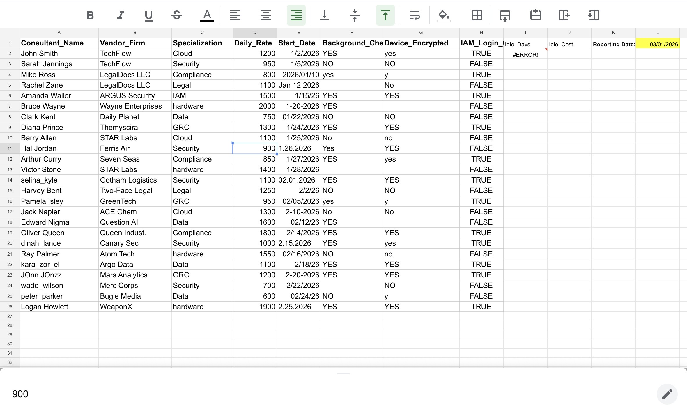
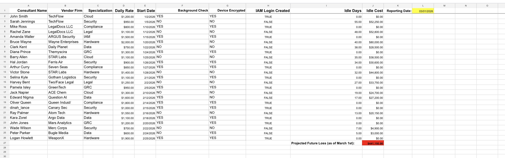
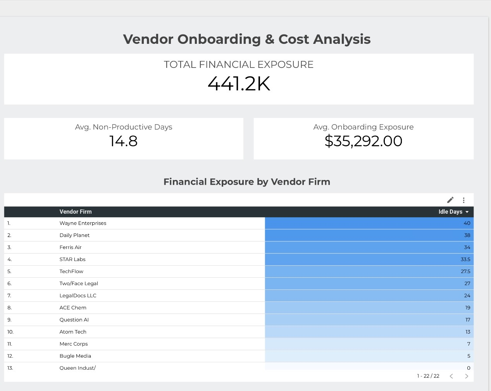

This project originates from my experience as an Independent Claims Adjuster working contracts where I was frequently not provisioned properly before my start date. I was being paid but unable to work due to missing system access, equipment delays, or incomplete onboarding. This is not unique to insurance. It happens across every industry that relies on contracted talent. This mock project models a structured IT provisioning workflow designed to eliminate that gap and protect companies from paying for idle time.

# Vendor Onboarding & Cost Analysis
Interactive Looker Studio dashboard identifying financial exposure and latency in contractor onboarding.

## Raw Data Extraction

*** Handled inconsistent vendor naming conventions & incomplete data fields.

## Data Transformation & Cleaning:

 Standardized 23 vendor firms.
 Calculated "Idle Days" using date-diff logic between start date and system provisioning date.
 Engineered a "Financial Exposure" metric to quantify the daily cost of downtime.

## Executive Dashboard

  Developed a single-page audit tool in Looker Studio.
  Highlighted a total financial exposure of $444k across 12 high-risk vendors.

## Key Features

   Interactivity: Cross-filtering allows for vendor-specific cost deep-dives.
   Prioriization: Heat-mapped tables instantly identify the most expensive bottlenecks

